# Компилятор языка программирования TinkovLang

---

## Краткое описание

Разработка данного языка началась в декабре 2023 года, когда в интернете были популярны мемы с нарезками цитат Олега Тинькова из интервью. Этим объясняется синтаксис языка и имена некоторых переменных в тестовых программах.

Компилятор представляет собой набор нескольких программ: [frontend](#frontend---лексический-и-синтаксический-анализ-построение-ast), [middleend](#middleend---оптимизации-над-ast), [backend](#backend---трансляция-в-nasm).

- [**frontend**](#frontend---лексический-и-синтаксический-анализ-построение-ast) - выполняет лексический анализ (токенизацию) и синтаксический анализ. Строит из токенов абстрактное синтаксическое дерево (AST)
- [**middleend**](#middleend---оптимизации-над-ast) - выполняет над AST набор оптимизаций (свертка констант и др)
- [**backend**](#backend---трансляция-в-nasm) - выполняет трансляцию AST в ассемблерный текст (NASM)

Язык поддерживает работу только с целыми числами, но с помощью [некоторых исхищрений](#точность-вычислений) успешно симулирует операции с плавающей точкой фиксированной точности.

## Установка и первый запуск

1. Клонирование репозитория

    ```
    git clone https://github.com/UjeNeTORT/tinkov_lang.git
    ```

2. Компиляция исходников TinkovLang

    ```
    make
    ```
3. Компиляция дефолтной программы на TinkovLang

    ```
    make compile
    ```
4. Запуск

    ```
    make run
    ```

Введите 3 числа - коэффициенты *a, b, c* квадратного уравнения $ax^2 + bx + c = 0$.

Насладитесь его корнями:

|  Невозможное уравнение  | Бесконечно много корней |
| :---------------------: | :---------------------: |
| 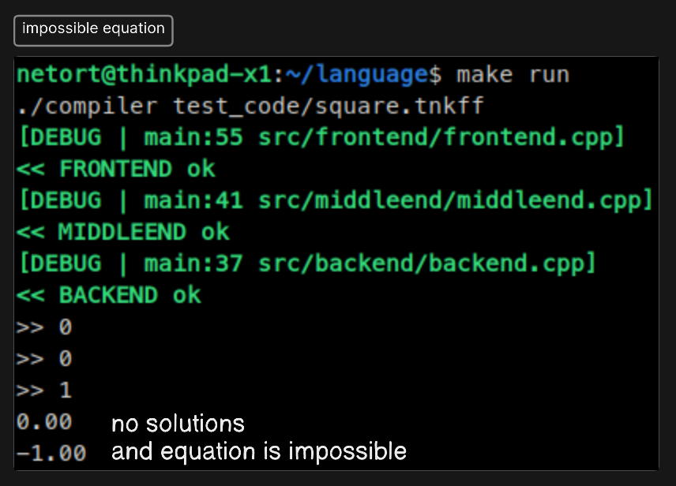 |  |

|        Один корень         |        Два корня        |
| :------------------------: | :---------------------: |
| 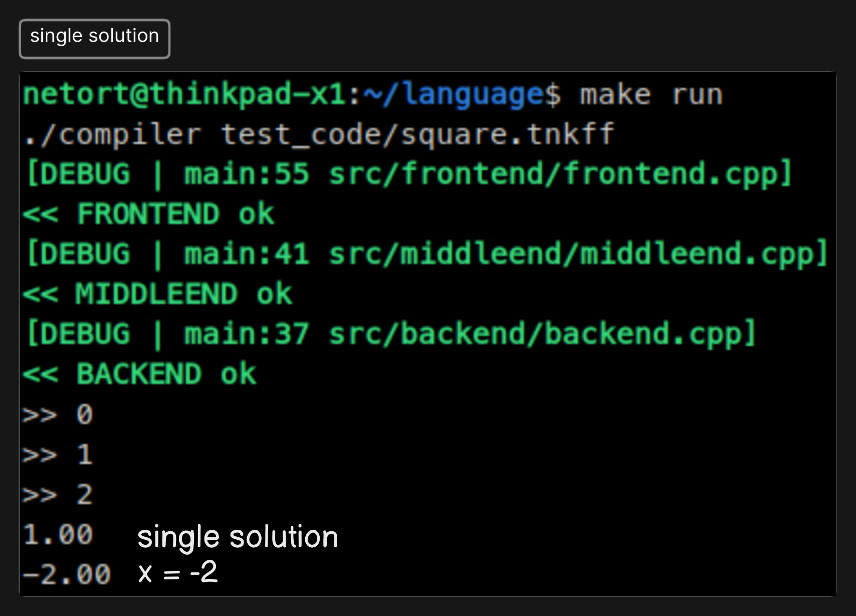 | 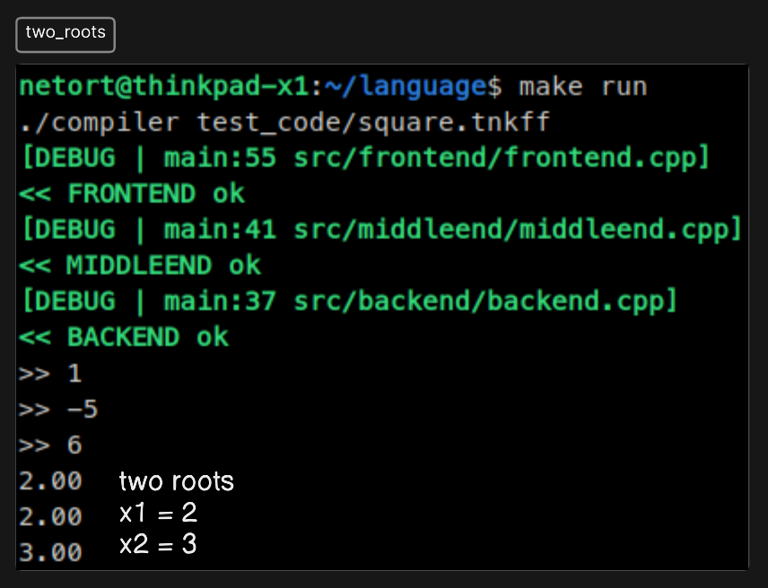 |
## Ваша первая программа на TinkovLang

### Исходник

1. Создайте файл с расширением `.tnkff`
2. Вставьте первой же строчкой заголовок

    <details>
    <summary><b>Заголовок, без которого не скомпилируется</b></summary>

    ```
    ДАННОЕ СООБЩЕНИЕ (МАТЕРИАЛ) СОЗДАНО И (ИЛИ) РАСПРОСТРАНЕНО ИНОСТРАННЫМ
    И РОССИЙСКИМ ЮРИДИЧЕСКИМ ЛИЦОМ, ВЫПОЛНЯЮЩИМ ФУНКЦИИ ИНОСТРАННОГО КОМПИЛЯТОРА
    А ТАКЖЕ ФИНАНСИРУЕТСЯ ИЗ ФОНДА КОШЕК ЕДИНИЧКИ И УПОМИНАЕТ НЕКОГО ИНОАГЕНТА
    ♂♂♂♂ Oleg ♂ TinCock ♂♂♂♂ (КТО БЫ ЭТО МОГ БЫТЬ). КОЛЯ ЛОХ КСТА, WHEN DANIL???
    ДЛЯ ПОЛУЧЕНИЯ ВЫИГРЫША НАЖМИТЕ ALT+F4.
    ```

    </details>

3. Определите ЦАРЬ-функцию (аналог main)

    <blockquote>
    <code>your_first_program.tnkff</code>

    ```
    ...
    россии_нужен ЦАРЬ за почти_без_переплат
    олег_не_торопись
        ...
    я_олигарх_мне_заебись
    ```
    </blockquote>

4. Объявите и обязательно инициализируйте 2 переменные

    <blockquote>
    <code>your_first_program.tnkff</code>

    ```
    ...
        грешник a я_так_чувствую 0 сомнительно_но_окей
        грешник b я_так_чувствую 0 сомнительно_но_окей
    ...
    ```
    </blockquote>

5. Запросите у пользователя значения переменных

    <blockquote>
    <code>your_first_program.tnkff</code>

    ```
    ...
        мне_надо a сомнительно_но_окей
        мне_надо b сомнительно_но_окей
    ...
    ```
    </blockquote>

6. Выведите их сумму

    <blockquote>
    <code>your_first_program.tnkff</code>

    ```
    ...
        там_кто_то_мне_пишет a + b сомнительно_но_окей
    ...
    ```
    </blockquote>

7. Верните 2007 из ЦАРЬ-функции

    <blockquote>
    <code>your_first_program.tnkff</code>

    ```
    ...
        никто_никогда_не_вернет 2007 сомнительно_но_окей
    ```
    </blockquote>

### Компиляция исходника

```
./compiler path/to/source.tnkff
```

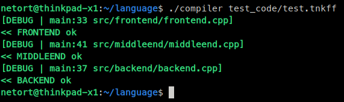

*Появятся зеленые надписи, что все ок*

Вы можете выполнить то же самое вручную:

1. Построить AST

   ```
    ./frontend path/to/tnkff/file.tnkff
   ```
    *Дерево сохранится в `ast.ast`*

2. Выполнить оптимизации над AST
    ```
    ./middleend ast.ast
   ```
    *Оптимизированное дерево сохранится в `ast.ast`*

3. Транслировать AST в NASM
    ```
    ./backend ast.ast
   ```
    *Ассемблерный листинг сохранится в `out.s`*

### Компиляция ассемблерного файла

```
nasm -f elf64 -g out.s -o out.o
g++ -no-pie out.o -o exec
```

### Запуск
```
./exec
```

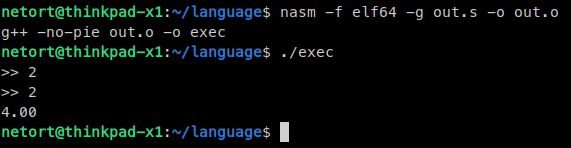

**2 + 2 = 4 !**

Кстати говоря, можете посмотреть на AST дерево ~~гусеницу~~, которое сгенерировал **frontend**:

<blockquote>
<code>src/tree/tree_dump/dumps/dumps/dump.html</code>

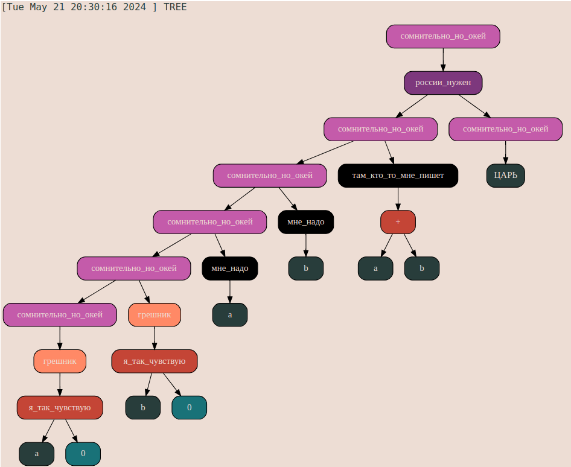

</blockquote>

Подробнее о структуре AST будет [позже](#структура-ast).

## Синтаксис TinkovLang

Синтаксис языка доступен в [EBNF нотации (расширенная форма Бэкуса-Наура)](https://en.wikipedia.org/wiki/Extended_Backus%E2%80%93Naur_form) в файле [`EBNF/EBNF.txt`](https://github.com/UjeNeTORT/tinkov_lang/blob/main/EBNF/EBNF.txt).

Примеры использования некоторых конструкций можете посмотреть в [`EBNF/omega_plus.txt`](https://github.com/UjeNeTORT/tinkov_lang/blob/main/EBNF/omega_plus.txt).

<blockquote>
<code>EBNF/omega_plus.txt</code>

```c
...
какая_разница x > 1 ?
олег_не_торопись
    <тело>
я_олигарх_мне_заебись
я_могу_ошибаться какая_разница  0 < x && x < 1  ?
олег_не_торопись
    <тело>
я_олигарх_мне_заебись
-----------------------------------------------
if (x > 1)
{
    <тело>
}
else if (0 < x && x < 1)
{
    <тело>
}
...
```
</blockquote>

**Синтаксис TinkovLang родственен синтаксису C**

|         C         |      TinkovLang       |
| :---------------: | :-------------------: |
|  // *comment*...  | сарказм *comment*...  |
| int (initializer) |        грешник        |
|         =         |    я_так_чувствую     |
|        if         |     какая_разница     |
|       else        |   я_могу_ошибаться    |
|       while       |   ну_сколько_можно    |
|         {         |   олег_не_торопись    |
|         }         | я_олигарх_мне_заебись |

**Особенности синтаксиса:**

- исходник программы требует обязательного заголовка, отсутствие которого приведет к потере пафосного вида программы и ошибке компиляции
- объявление переменной требует обязательной инициализации
- представлена конструкция do-if, о смысле которой гадает даже автор программы
- для усиления комического эффекта пользователю доступен набор ничего не значащих лексем, которые игнорируются фронтендом (см. [`src/frontend/lang_syntax.h`](https://github.com/UjeNeTORT/tinkov_lang/blob/main/src/frontend/lang_syntax.h))

## Структура AST

**Абстрактное дерево синтаксиса** - это способ представить программу в удобном для парсинга виде и сохранить при этом ее логическую структуру.

Я выбрал сделать AST бинарным, т.к. к моменту начала работы у меня уже было написано бинарное дерево с возможностью его чтения и записи в файл и функциями для оптимизации.

Приведем простейший пример представления программы в виде бинарного дерева на примере математических вычислений:

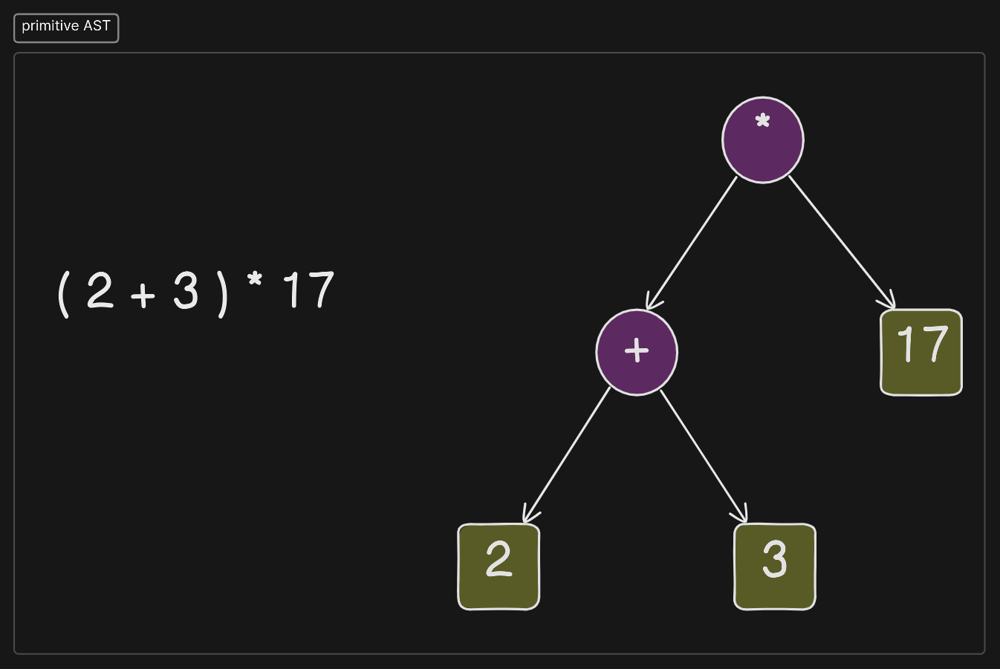

Вопрос хранения последовательности инструкций решается созданием узлов-контейнеров, которые в себе не хранят никакой информации, но выстраиваются в цепочку, сохраняя очередность инструкций.

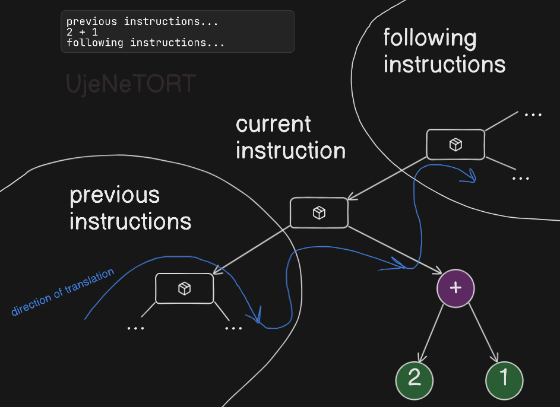

Некоторым узлам требуется хранить больше, чем двух детей. Эта проблема также решается созданием дополнительных узлов:

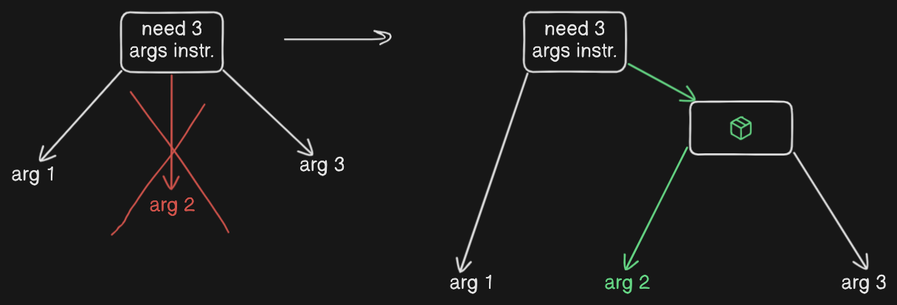

<!--todo-->

## FrontEnd - лексический и синтаксический анализ, построение AST

Вид исходного кода программы определен правилами формальной грамматики. Однако изначально текст программы - это просто последовательность байт,
анализировать которую сложно. Для решения этой проблемы перед синтаксическим анализом текста выполняется лексический (токенизация).

### Лексический анализ (токенизатор)

Роль лексера в том, чтобы разбить большую строку (текст программы) на последовательность компактных абстракций, с которыми будет легче оперировать синтаксическому анализатору.
Эти абстракции представлены в таблице:

| AST node type | code  | description                                                            |
| :------------ | :---: | :--------------------------------------------------------------------- |
| `ERROR`       |   0   | none of other token types match                                        |
| `IDENTIFIER`  |   1   | names assigned by the programmer                                       |
| `DECLARATOR`  |   2   | is used to declare variable / function                                 |
| `KEYWORD`     |   3   | reserved words of the language (while, for, if, return, int in C)      |
| `SEPARATOR`   |   4   | punctuation characters ({, (, ;, in C)                                 |
| `OPERATOR`    |   5   | symbols that operate on arguments and produce result (<, =, +, / in C) |
| `INT_LITERAL` |   6   | integer decimal number                                                 |

<!--
| STR_LITERAL   | 7    | null-terminated sequence of chars |
-->

Лексер представляет собой конечный автомат, анализирующий лексему - последовательность непробельных символов, имеющих по бокам пробельные.

<blockquote>
<code>src/frontend/frontend.cpp</code>

```c
    if (IsLineComment (lexem))
    {
        // ignore comment
    }
    else if (IsDeclarator (lexem))
    {
        ...
    }
    else if (IsKeyword (lexem))
    {
        ...
    }
    ...
    else
    {
        LEXER_ERR ("Unknown lexem \"%s\"", lexem);
    }
```

</blockquote>

В результате анализа генерируется токен - узел дерева (пока никуда не подвешенный), хранящий type = AST node type code и val = id конкретной лексемы ([подробнее](#структура-ast)).

Этот токен вставляется в массив и в конце лексического анализа мы получаем массив структур, значение каждой из которых мы уже знаем.

### Синтаксический анализ - построение AST

Массив токенов, полученный в результате лексического анализа еще не является удобным представлением программы для трансляции в язык ассемблера.

Мы хотим перевести линейное представление программы в древовидное, для этого используем алгоритм [рекурсивного спуска](https://en.wikipedia.org/wiki/Recursive_descent_parser).

Он выгодно отличается от других своей простотой реализации и точностью указания мест ошибок программиста.

Во время написания рекурсивного спуска я опирался на [EBNF нотацию, упомянутую ранее](#синтаксис-tinkovlang).

В случае ошибки программиста, синтаксический анализатор выдает сообщение указывающее на ее предполагаемую причину.

Полученное дерево сохраняется в файл `ast.ast` в in-order формате.

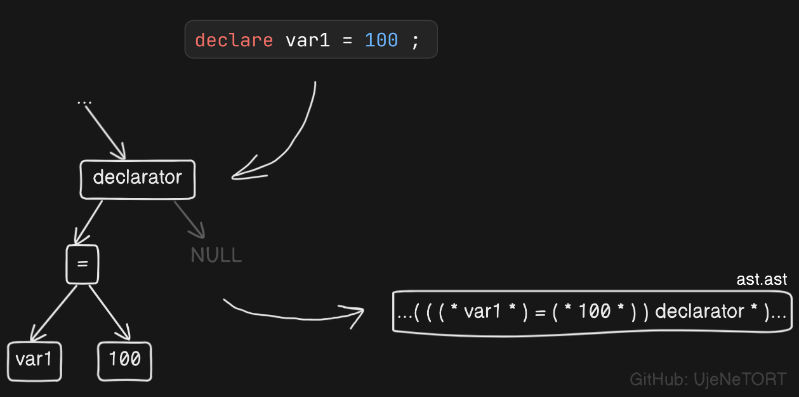

## MiddleEnd - оптимизации над AST

Сохраненное дерево дословно передает логику заложенную программистом, в таком виде она не всегда удобна для исполнения на ассемблерном уровне.

Поэтому можно провести ряд оптимизаций над AST, которые не поменяют логику работы программы, но при этом облегчат жизнь для backend.

Оптимизации представленные в middleend:

|          Оптимизация           |                Пример                |
| :----------------------------: | :----------------------------------: |
|        Свертка констант        | 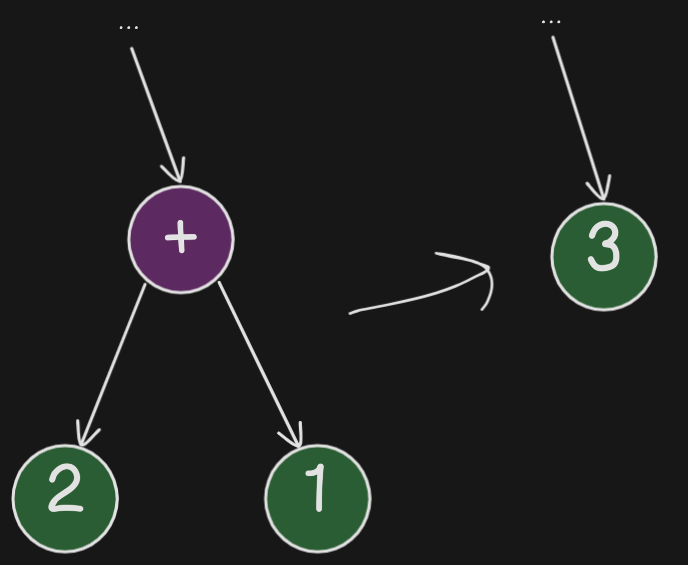  |
| Удаление нейтральных элементов | 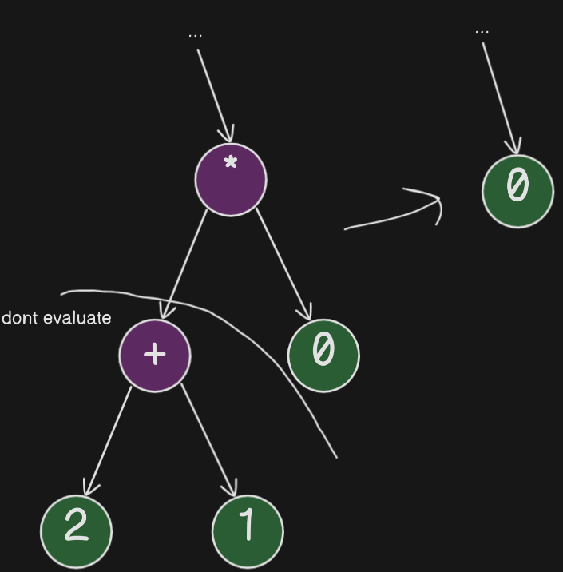 |

Оптимизированное AST сохраняется поверх старого.

## BackEnd - трансляция в NASM

За трансляцию в NASM отвечает `backend`. Эта программа считывает дерево и транслирует его снизу вверх (в соответствие схеме узлов-контейнеров).

### Организация вычислений

Представлены вычисления с фиксированной точностью, использующие специально-выделенный для этого стек.

#### Точность вычислений

Все числа хранятся в памяти в виде **int64_t**.
Тем не менее, компилятор поддерживает **вычисления с фиксированной точностью**.

Достигается это за счет того, что при каждом упоминании числа в исходном коде программы, в память оно помещается умноженным, например, на 100. Получается, что если такое число разделить нацело на 3, а потом вывести на печать, поставив точку перед двумя последними цифрами, то мы смогли симулировать вычисления с плавающей точкой.

<blockquote>
<code>src/backend/backend.h</code>

```c
const unsigned INT_PRECISION_POW = 2;
```

За точность вычислений отвечает константа, определенная в заголовочном файле. В данном случае поправка составляет $10^2 = 100$

</blockquote>

Возникает проблема, что при умножении и делении результат будет либо умноженным на 100 дважды, либо неумноженным вовсе.

Эту проблему можно решить, делая **коррекцию точности** - деля результат на 100 в случае умножения и умножая делимое на 100 в случае деления.

Такой подход не является лучшим, так как вынуждает выполнять дорогостоящее деление при каждом случае умножения двух чисел. Еще мы вынуждены на каждое действие выполнять больше операций, чем теоретически требуется.

Преодолеть эти проблемы можно, представив полноценную арифметику с плавающей точкой, однако этого не было сделано из-за ограничений существующего стандарта дерева и поддержки совместимости с трансляцией в код моего виртуального процессора.

#### Стек вычислений

Для вычислений в памяти выделяется еще один стек, помимо аппаратного. Для стека вычислений в качестве rsp служит регистр r15.

Стековая архитектура вычислений обусловлена тем, что в первой версии код моего языка транслировался в мой же виртуальный процессор, где вычисления как раз были стековыми.

При входе в узел сначала транслируются его дети (push в стек вычислений). После этого над ними выполняется операция и ее результат также помещается в стек вычислений вместо операндов.

### Локальные переменные и вызов функций

in progress...

### Трансляция условий

in progress...

### Стандартная библиотека

В файле [`src/stdlib_tnkff/stdlib_tnkff.s`](https://github.com/UjeNeTORT/tinkov_lang/blob/main/src/stdlib_tnkff/stdlib_tnkff.s) хранится набор стандартных функций, написанных на ассемблере, которые может задействовать backend.

Функции стандартной библиотеки:

| Функция         | Назначение                                |
| :-------------- | :---------------------------------------- |
| `scan_int64_t`  | чтение целого числа                       |
| `print_int64_t` | вывод числа с фиксированной точностью     |
| `div_10`        | оптимизированное деление на 10            |
| `mod_10`        | оптимизированный остаток от деления на 10 |
| `sqrt_int64_t`  | целочисленный квадратный корень           |
| `divide`        | облегчает использование инструкции idiv   |


<blockquote>
<code>src/stdlib_tnkff/stdlib_tnkff.s</code>

```asm
div_10:
        push    rbp
        mov     rbp, rsp

        sub     rsp, 8  ; space for locals
        push    rcx     ; rcx is used in "rep" in upper funcs

        mov     QWORD [rbp - 8], rdi
        mov     rcx, QWORD [rbp - 8]
        mov     rdx, 7378697629483820647
        mov     rax, rcx
        imul    rdx
        sar     rdx, 2
        mov     rax, rcx
        sar     rax, 63
        sub     rdx, rax
        mov     rax, rdx

        pop     rcx     ; rcx is used in "rep" in upper funcs
        add     rsp, 8  ; pop locals

        pop     rbp
        ret
```
</blockquote>

## BackEnd - трансляция в код моего виртуального процессора

in progress...

## Источники

in progress...

nasm vs spu and acceleration
5394429 7338866, acceleration = 1.36